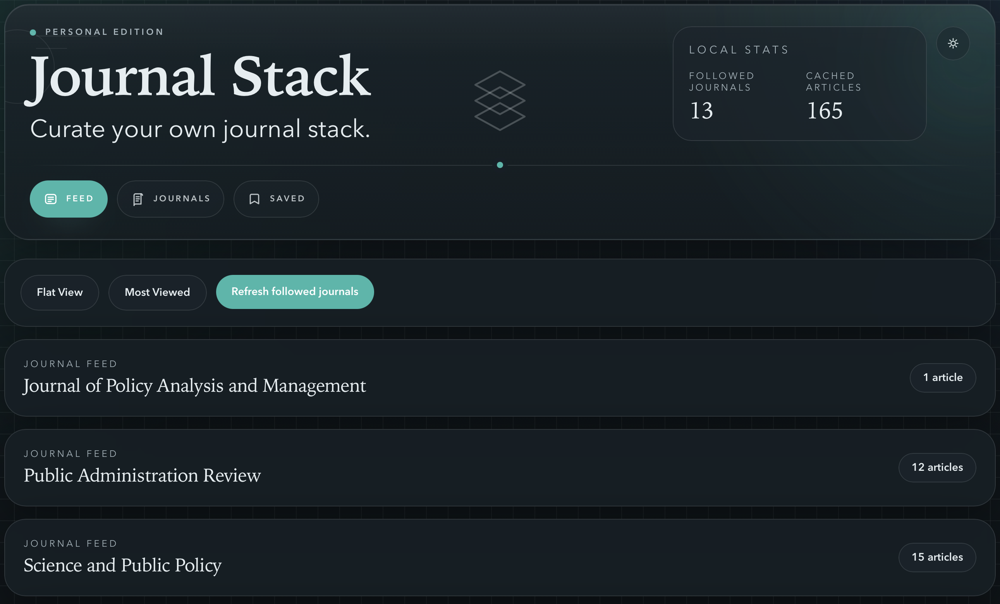
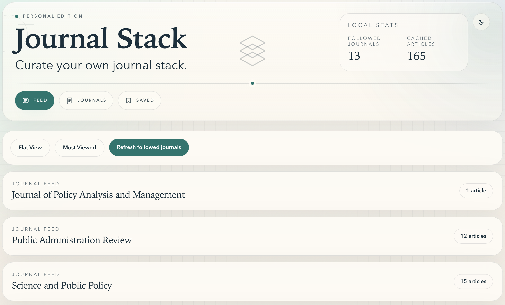

# Journal Stack

Journal Stack is a local-first app for keeping up with the journals you care about and getting to full text with less friction.

It is built for a simple workflow: follow journals, scan new articles, save what matters, and open either the publisher page or your institution-routed access link from one place.

## Screenshots

| Feed | Journals |
| --- | --- |
|  |  |

## What You Can Do

- Follow journals and keep a personal list of sources you care about
- Add journals by RSS feed URL or Crossref ISSN, with one-click metadata lookup
  that auto-fills the publisher, homepage, and ISSNs
- Edit or delete journals at any time
- Refresh followed journals to pull in newly available articles
- Browse your literature feed in either `Journal View` or `Article View`
- Sort by `Most Recent` or `Most Viewed`
- Open article details with title, authors, abstract, DOI, and journal metadata
- Choose between `Open journal link` and `Open via Institution`
- Save articles into a lightweight reading queue
- Run it as a native desktop app (see Desktop App below) or in the browser
- Work in a clean, local-first interface without depending on a hosted service

## Main Views

### Feed

The feed is the main reading surface. It is designed for quickly scanning what is new across the journals you follow.

You can:

- group articles by journal
- switch to a flat chronological list (`Article View`)
- sort by recency or by tracked opens
- jump directly from discovery to the article page or access link

### Journals

The journals page is where you manage your source list.

You can:

- add a journal by title plus either an RSS feed URL or a Crossref ISSN
- use `Look up journal details` to auto-fill publisher, homepage, and ISSNs
- edit or delete an existing journal
- follow or unfollow a journal
- refresh a journal source on demand

### Saved

The saved view acts as a lightweight reading queue for articles you want to return to later.

## Why Use It

Journal Stack is useful if your current workflow looks something like:

- checking several journal sites separately
- clicking through multiple publisher pages
- bouncing through a library resolver to reach full text

Instead, this app gives you one place to monitor journals and two clear next actions on each article:

- go straight to the publisher page
- go through the institution-aware route

## Run It Locally

```bash
npm install
cp .env.example .env
npm run db:migrate
npm run db:seed
npm run dev
```

Then open `http://localhost:3000/feed`.

## Desktop App (Tauri)

Journal Stack can be packaged as a standalone Windows desktop app using Tauri.
The desktop build keeps the full Next.js app intact and runs it as a bundled
Node sidecar on a private loopback port — no separate server to start, no port
exposed on the network. Source for the shell lives in [`desktop/`](./desktop).

### Prerequisites (one-time)

- Rust with the MSVC toolchain:
  `rustup default stable-x86_64-pc-windows-msvc`
- Visual Studio C++ Build Tools ("Desktop development with C++" workload)
- Node.js 22.x (the same major version is bundled into the app)

### Build the installer

From the repo root, produce the standalone server and copy it into the
desktop resources:

```powershell
npm install
npm run build

# Copy the standalone payload Tauri bundles (server.js + static + public).
# Wipe the assembled payload first — Copy-Item -Recurse nests a folder inside
# an existing same-named target, which silently breaks static asset serving.
Remove-Item -Recurse -Force desktop\resources\app -ErrorAction SilentlyContinue
New-Item -ItemType Directory -Force `
  desktop\resources\app\scripts, desktop\resources\app\public | Out-Null
Copy-Item -Recurse -Force .next\standalone\* desktop\resources\app\
Copy-Item -Recurse -Force .next\static       desktop\resources\app\.next\static
Copy-Item -Recurse -Force public\*           desktop\resources\app\public\

# Copy migrations, seed data, first-run scripts, and a Node binary for the sidecar
New-Item -ItemType Directory -Force desktop\resources\migrations, `
  desktop\resources\seed, desktop\resources\app\scripts | Out-Null
Copy-Item -Recurse -Force prisma\migrations\*        desktop\resources\migrations\
Copy-Item -Force data\journals.example.json          desktop\resources\seed\
Copy-Item -Force scripts\apply-migration.mjs         desktop\resources\app\scripts\
Copy-Item -Force desktop\scripts\seed.mjs            desktop\resources\app\scripts\
Copy-Item -Force (Get-Command node).Source `
  desktop\src-tauri\binaries\node-x86_64-pc-windows-msvc.exe
```

Then build the app:

```powershell
cd desktop
npm install
npm run tauri build
```

Installers are written to
`desktop/src-tauri/target/release/bundle/` (`.msi` and NSIS `.exe`).

### Desktop runtime notes

- The database lives in your app-data dir
  (`%APPDATA%\com.journalstack.app\dev.db`), separate from the dev `prisma/dev.db`.
- On first launch the app migrates and seeds automatically. A startup log is
  written next to the database (`startup.log`) for troubleshooting.
- The build artifacts under `desktop/` (`node_modules`, `resources`,
  `src-tauri/target`, `src-tauri/binaries`) are gitignored and regenerated by
  the steps above.

## Notes

- Journal Stack is a server-rendered app, not a static site.
- Data is stored locally in `prisma/dev.db`.
- GitHub is useful for syncing the code between machines, but not for hosting the full app on GitHub Pages in its current form.

